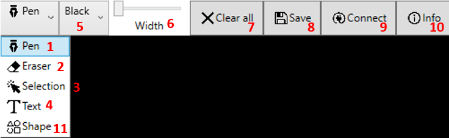
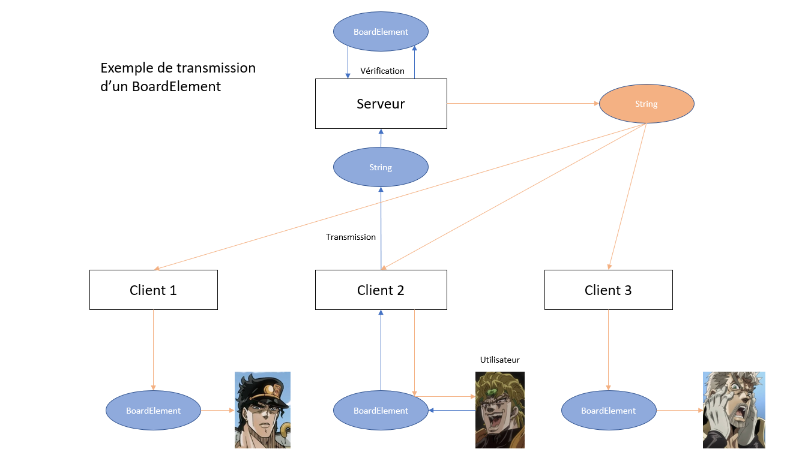

# Whiteboard

## Introduction
Whiteboard permet de créer un tableau blanc collaboratif.

## Features principales
- Connexion à un serveur par nom et adresse IP
- Traits, formes et zones de texte
- Possibilité de paramétrer les traits : couleur, épaisseur
- Possiblité d'effacer, modifier et déplacer les éléments
- Sauvegarder le tableau sous format jpg

## Installation
### Installations prérequises
Notre projet utilise les utilitaires WPF et ASP.Net. Ils ne sont pas nécessaires pour utiliser les exécutables mais le sont pour compiler le code.

## Utilisation
### Serveur
Lancez Server.exe pour configurer le serveur. Selectionnez une adresse IP parmi la liste proposée en rentrant l'index associé, et le serveur est prêt.

### Application
Lancez WhiteboardWPF.exe pour accèder à l'application. Vous devriez tomber sur une fenêtre blanche avec cette barre à outils :

#### Créer/Rejoindre un tableau (NECESSAIRE AVANT DE TRACER)
- Cliquez sur le bouton "Connect" (9), une fenêtre s'affiche.
- Rentrez l'adresse IP du serveur dans la première case et le nom du tableau dans la deuxième, puis cliquez sur "Connect".
- Si un tableau a déjà été créé pour cette adresse IP et ce nom, vous rejoindrez le tableau. Sinon, vous créez ce tableau.
- La liste déroulante en haut de la fenêtre vous permet de choisir parmi plusieurs actions, notamment "Create board with name" crée un nouveau tableau avec un nom aléatoire et "Join board" permet de simplement rejoindre un tableau existant.

#### Partager un tableau
- Vous pouvez accèder à tout moment à l'adresse IP du serveur et le nom du tableau en cliquant sur le bouton "Info" (10).
- Rentrez ces informations sur un autre terminal en suivant les étapes détaillées dans la partie précedente pour rejoindre le même tableau.

#### Ecrire sur le tableau
Il y a quatre modes d'édition sur le tableau utilisables via une liste déroulante :
- Pen (1) qui correspond à de simples traits
- Eraser (2) qui permet de gommer à la manière d'une sélection. Pour effacer un ou plusieurs éléments du tableau vous pouvez soit entourer ces élements avec la souris soit cliquer directement dessus.
- Selection (3) qui permet de faire du drag-and-drop sur un élement
- Text (4) qui permet de créer une zone de texte en cliquant sur le tableau
Vous pouvez modifier la couleur et l'epaisseur des traits à l'aide des boutons (5) et (6).
- Shape (11) fait apparaître un nouveau menu déroulant permettant de choisir parmi 3 formes : triangle, carré ou cercle. Si vous voulez créer un carré ou un cercle, cliquez une première fois sur le tableau puis maintenez en vous déplaçant pour obtenir la forme souhaitée. Si vous voulez tracer un triangle, cliquez aux points correspondant aux trois sommets.
- Le bouton (7) efface le contenu entier.

#### Sauvegarder son tableau
Le tableau peut être sauvegardé en appuyant sur le bouton Save (8). Une fenêtre s'ouvre pour spécifier l'endroit où enregistrer l'image sous format jpg.

## Structure du code

### Echanges client-serveur

Chaque élement tracé hérite de la classe abstraite BoardElement, qui donne un cadre aux méthodes d'ajout/suppression/selection sur le tableau et à la conversion en string.
Les échanges entre l'utilisateur et le serveur peuvent être représentés comme ceci :

### Gestion du tableau

Le font se base sur WPF, notamment l'objet InkCanvas qui permet de gérer le tracé des traits et la selection. La gestion des évènements permet d'ajouter la communication avec le serveur ainsi que d'étendre les fonctionnalités.
